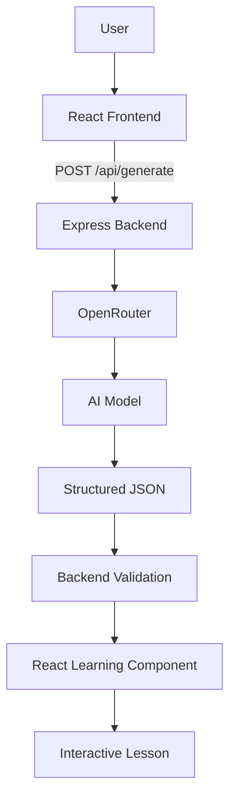
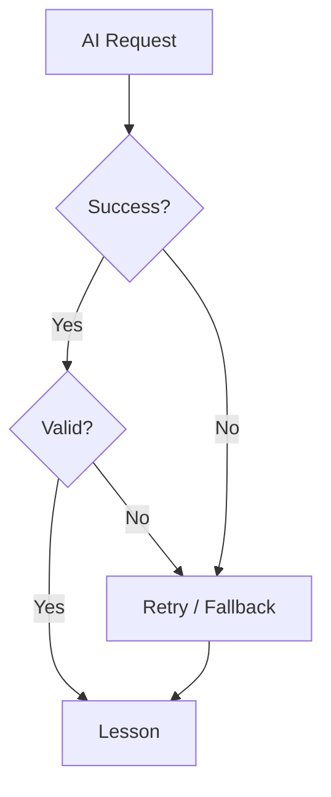
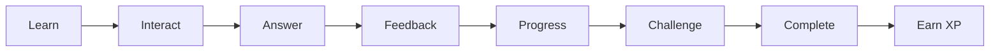
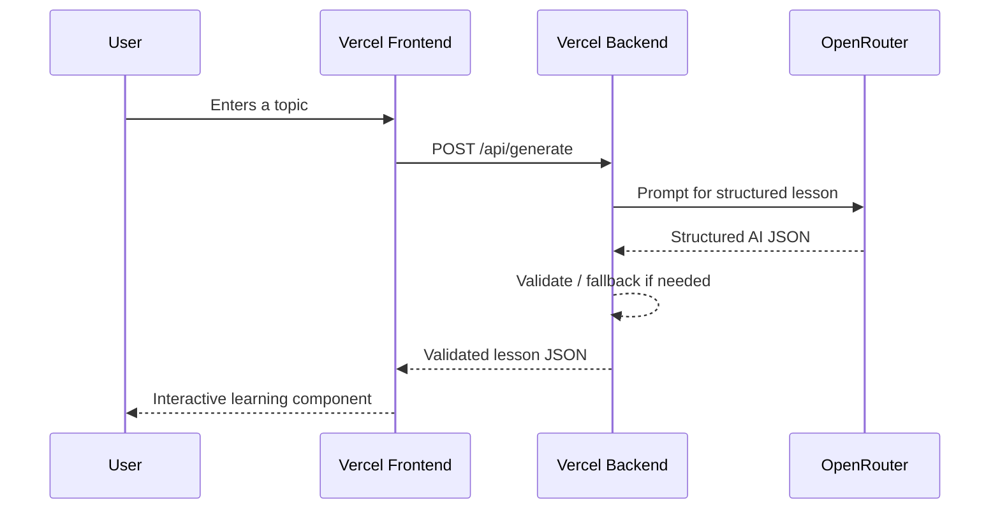
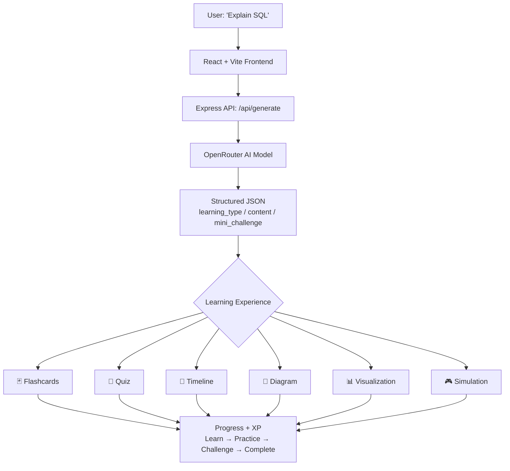

# 🚀 Interactive AI Learning — Project Journey

> From a simple idea to a fully functional, AI-powered interactive learning platform.

**One-line summary:** *I built a system where AI decides how a topic should be taught, converts that decision into structured learning content, and the frontend turns that content into an interactive learning experience.*

---

## 📌 Project Overview

| | |
|---|---|
| **Project** | Interactive AI Learning Platform |
| **Repository** | `gamification-with-ai` |
| **Frontend** | React + Vite |
| **Backend** | Node.js + Express |
| **AI** | OpenRouter (Llama model) |
| **Deployment** | Vercel (frontend & backend as separate projects) |
| **Status** | 🟢 Live and Functional |

---

## 📖 Table of Contents

1. [Where the Idea Started](#-1-where-the-idea-started)
2. [The Main Goal](#-2-the-main-goal)
3. [Initial Architecture](#️-3-initial-architecture)
4. [AI Response Architecture](#-4-ai-response-architecture)
5. [The Six Learning Modes](#-5-the-six-learning-modes)
6. [Building the Frontend](#-6-building-the-frontend)
7. [The Bugs — A Struggle Log](#-7-the-bugs--a-struggle-log)
8. [Local Fallback System](#️-8-local-fallback-system)
9. [Recovering with Git](#-9-recovering-with-git)
10. [Moving to Another Laptop](#-10-moving-to-another-laptop)
11. [Backend Testing with Postman](#-11-backend-testing-with-postman)
12. [UI, Responsiveness & History](#-12-ui-responsiveness--history)
13. [Gamification & the Duolingo Inspiration](#-13-gamification--the-duolingo-inspiration)
14. [Performance & Loading Experience](#-14-performance--loading-experience)
15. [Deployment Journey](#-15-deployment-journey)
16. [Final Architecture](#-16-final-architecture)
17. [Debugging Lessons](#-17-debugging-lessons)
18. [The Workflow That Finally Worked](#-18-the-workflow-that-finally-worked)
19. [What Makes This Project Different](#-19-what-makes-this-project-different)
20. [Milestone Checklist](#-20-milestone-checklist)
21. [Where It Can Go Next](#-21-where-it-can-go-next)
22. [Final Reflection](#-22-final-reflection)

---

## 🧠 1. Where the Idea Started

> **What if AI didn't just explain a topic, but decided the best way to teach it?**

Instead of asking *"How can AI explain this topic?"*, the question became:

> **"How can AI teach this topic in the most engaging way?"**

| Topic Type | Learning Experience |
|---|---|
| Definitions | 🃏 Flashcards |
| Revision | 🧠 Quiz |
| Algorithms | 🧭 Timeline |
| Processes | 🎮 Simulation |
| Relationships | 🔗 Diagram |
| Comparisons | 📊 Visualization |

The goal: make learning feel less like reading documentation and more like interacting with an educational game.

## 🎯 2. The Main Goal

> **AI generates the lesson. The frontend turns the lesson into an experience.**

The project needed to:
- Understand the user's topic
- Select an appropriate learning strategy
- Return structured JSON
- Render that JSON as an interactive React component
- Track lesson progress, give a mini challenge, reward completion with XP

## 🏗️ 3. Initial Architecture

```text
gamification-with-ai/
│
├── backend/
│   ├── server.js
│   ├── src/
│   │   ├── app.js
│   │   ├── controllers/
│   │   ├── routes/
│   │   ├── services/
│   │   ├── middleware/
│   │   └── config/
│   └── package.json
│
└── frontend/
    ├── src/
    │   ├── components/
    │   ├── pages/
    │   ├── services/
    │   ├── hooks/
    │   ├── utils/
    │   └── App.jsx
    └── package.json
```

The frontend talks to the backend through a single endpoint:

```text
POST /api/generate
```



## 🤖 4. AI Response Architecture

The AI was made to return structured JSON instead of plain text:

```json
{
  "title": "",
  "learning_type": "",
  "subtype": "",
  "difficulty": "",
  "reason": "",
  "estimated_time": "",
  "content": {}
}
```

`learning_type` became the bridge between AI and frontend — `"quiz"` → React selects `Quiz.jsx` → the AI content becomes an interactive quiz. This let one backend power six completely different experiences.

## 🎮 5. The Six Learning Modes

<details>
<summary>🃏 <strong>Flashcards</strong> — definitions, facts, terminology, quick revision</summary>

```text
Question → Flip → Answer → Know / Review Again
```
</details>

<details>
<summary>🧠 <strong>Quiz</strong> — revision, testing knowledge, concept checking</summary>

```text
Question → Choose Answer → Immediate Feedback → Explanation → Next Question
```
</details>

<details>
<summary>🧭 <strong>Timeline</strong> — sequential concepts, algorithms, historical development, processes</summary>

```text
Step 1 → Step 2 → Step 3 → ...
```
</details>

<details>
<summary>🔗 <strong>Diagram</strong> — relationships, dependencies, connected concepts, structures</summary>

Makes relationships easier to understand visually.
</details>

<details>
<summary>📊 <strong>Visualization</strong> — comparisons, categories, data-like concepts</summary>

Used for concept relationships that read better side-by-side than in prose.
</details>

<details>
<summary>🎮 <strong>Simulation</strong> — step-by-step processes, practical workflows, systems, algorithms</summary>

The goal was to eventually make this feel more like interacting with a system than reading instructions.
</details>

## 🧩 6. Building the Frontend

```text
Flashcards.jsx   Quiz.jsx   Timeline.jsx
Diagram.jsx      Visualization.jsx   Simulation.jsx
```

A central mapping decided which component to render:

```javascript
const componentMap = {
    flashcards: Flashcards,
    quiz: Quiz,
    timeline: Timeline,
    diagram: Diagram,
    visualization: Visualization,
    simulation: Simulation
};
```

This mapping was one of the most important architectural pieces of the whole project.

---

## 🐛 7. The Bugs — A Struggle Log

Every one of these felt like a dead end at the time. None of them were.

<details>
<summary><strong>1️⃣ AI didn't always return valid JSON</strong></summary>

The app expected `{ "title": "...", "learning_type": "...", "content": {} }` but sometimes got prose wrapped around a code fence, or incomplete JSON — causing `AI response could not be parsed as valid JSON`.

**Fix — a defensive parser:**
1. Try the raw response
2. Strip Markdown code fences
3. Find the first JSON object
4. Parse the candidate
5. Validate the learning type
6. Validate the content structure

> **Never blindly trust an AI response.**
</details>

<details>
<summary><strong>2️⃣ OpenRouter 404 — model no longer available</strong></summary>

```text
AxiosError: Request failed with status code 404
```

The request was hitting `https://openrouter.ai/api/v1/chat/completions` with a model that was no longer available through the selected route. The model configuration had to be corrected.

> **AI applications depend not only on prompts, but also on model availability and API configuration.**
</details>

<details>
<summary><strong>3️⃣ The AI kept over-selecting "Timeline"</strong></summary>

Timeline was a "safe," general-purpose structure the model could fall back to for almost anything — so it started showing up for unrelated topics. Fixed by giving the system prompt explicit per-type guidance:

```text
Definitions   → flashcards
Facts         → flashcards
Algorithms    → timeline
Processes     → simulation
Relationships → diagram
Comparisons   → visualization
Revision      → quiz
```
</details>

<details>
<summary><strong>4️⃣ Mini-challenges were missing or incomplete</strong></summary>

The UI would show `No mini challenge provided for this lesson` because the AI sometimes returned an empty or missing `mini_challenge`. Fixed by making the backend guarantee a challenge exists, generating fallback content when necessary.

> **If an AI-generated field is important to the application, it should not depend entirely on the model behaving perfectly.**
</details>

<details>
<summary><strong>5️⃣ The project broke while mid-improvement</strong></summary>

After several simultaneous changes (response handling, learning modes, mini challenges, progress, history, UI), the project stopped working. The fix was recovering the last known working Git commit.

> **Git is not just for uploading code — it's a recovery system.**
</details>

<details>
<summary><strong>6️⃣ Vercel backend crash</strong> — <code>FUNCTION_INVOCATION_FAILED</code></summary>

```text
500: INTERNAL_SERVER_ERROR
Invalid export found in module "/var/task/backend/src/app.js".
The default export must be a function or server.
```

The local server worked because it called `app.listen(PORT)` in `server.js` — but Vercel Serverless Functions expect the app to be exposed differently. The backend had to be adapted. First sign of life after the fix:

```json
{ "success": true, "message": "Interactive AI Learning Backend is running 🚀" }
```
</details>

<details>
<summary><strong>7️⃣ Protected deployment</strong> — <code>401 Protected deployment</code></summary>

The application code was fine — Vercel's deployment protection setting was blocking API access.

> **A successful deployment does not necessarily mean the endpoint is publicly accessible.**
</details>

<details>
<summary><strong>8️⃣ The final deployment bug — an uncommitted file</strong></summary>

Frontend live. Backend live. Backend tested and working. And still:

```text
Unable to reach the server. Please try again.
```

The cause: `frontend/src/services/api.js` was correct locally but had never been committed — so GitHub, and therefore Vercel, was still serving the old version.

```text
Local application → works
Backend           → works
Frontend deploy   → works
Frontend+Backend  → ❌   (until the commit landed)
```

One `git commit` + `git push` later, everything worked.
</details>

**The full failure chain, in order:**

```text
❌ Invalid/unparsable AI JSON
❌ OpenRouter 404 (bad model config)
❌ AI over-selecting "timeline"
❌ Missing mini challenges
❌ Project broke mid-improvement → Git recovery
❌ Vercel serverless crash (invalid export)
❌ Protected deployment (401)
❌ Uncommitted frontend api.js
✅ LIVE APPLICATION
```

## 🛡️ 8. Local Fallback System

If the AI request fails, JSON parsing fails, the model returns incomplete content, or validation fails, the backend now generates a simple local lesson instead of breaking outright:



This changed the app from *"AI works or the application breaks"* into *"AI works normally, but the application still has a safety net."*

## 🔁 9. Recovering with Git

The workflow after the mid-project breakage became:

```text
Make change → Test → Working? → Commit
```

instead of stacking up many uncommitted changes at once — turning Git commits into checkpoints, not just backups.

## 💻 10. Moving to Another Laptop

Development had to continue on a different machine after available AI coding tool tokens ran out on the original setup. The repo was cloned fresh and rebuilt from scratch:

```text
Node.js → npm → VS Code → Git
→ Frontend deps → Backend deps
→ Environment variables → OpenRouter API key
```

> **A project is not truly portable until someone can clone it and run it again.**

## 🔧 11. Backend Testing with Postman

Before touching deployment, the backend was verified independently:

```text
POST /api/generate
{ "prompt": "Explain SQL", "level": "Beginner" }
```

returning structured lesson data — proof the backend wasn't just running, it was producing usable content. Debugging `Frontend + Backend + AI + Deployment` all at once is hard; isolating the backend with Postman made problems far easier to locate.

## 🎨 12. UI, Responsiveness & History

**Visual direction:** modern, premium, minimal, dark/glass aesthetic, smooth flow, good contrast, no unnecessary clutter — not another generic AI dashboard.

**Responsiveness:** desktop-sized typography and fixed layouts didn't survive contact with mobile — buttons crowded, controls not adapting. Fixed by designing desktop → tablet → mobile as a deliberate progression, not a shrink-to-fit.

**Learning history:** the homepage moved from always showing static example prompts to surfacing the user's own recent prompts (e.g. *React Hooks, SQL, CPU Scheduling*) — making the app feel like it remembers the learner.

## 🎮 13. Gamification & the Duolingo Inspiration

```text
Lesson Progress
████████████░░ 80%
XP: 20
Complete the activity → +10 XP
```

The conceptual influence was Duolingo-style interactivity — not to copy it, but to apply its core principle:

> **Even a difficult or boring topic should feel interactive.**



## ⚡ 14. Performance & Loading Experience

The external AI call was the real latency bottleneck (not JSON parsing). Rather than a blank screen, the app narrates what it's doing:

```text
Analyzing topic...
Choosing best learning strategy...
Building lesson...
Preparing interactive experience...
Almost ready...
```

## 🔌 15. Deployment Journey



Backend and frontend were deployed as **separate Vercel projects** from GitHub. Production now returns real structured content:

```json
{
  "success": true,
  "data": {
    "title": "Introduction to SQL",
    "learning_type": "flashcards",
    "difficulty": "Beginner",
    "content": {
      "overview": "...",
      "key_points": [],
      "mini_challenge": {},
      "cards": []
    }
  }
}
```

## 🟢 16. Final Architecture



## 🧪 17. Debugging Lessons

<details>
<summary><strong>1. AI output is not guaranteed</strong></summary>

`AI output → Parse → Validate → Fallback` is safer than `AI output → Trust it`, even when the model is explicitly instructed to return JSON.
</details>

<details>
<summary><strong>2. Test the backend separately</strong></summary>

Postman let the backend be debugged in isolation instead of fighting Frontend + Backend + AI + Deployment all at once.
</details>

<details>
<summary><strong>3. Git commits are checkpoints</strong></summary>

`Change → Run → Test → Confirm working → Commit` is far safer than dozens of changes before a single commit.
</details>

<details>
<summary><strong>4. Local success ≠ production success</strong></summary>

`localhost` can work perfectly and still fail on Vercel because of serverless architecture, env variables, deployment config, CORS, protected deployments, production URLs, and build config.
</details>

<details>
<summary><strong>5. Check the Network tab before rewriting anything</strong></summary>

`Browser → DevTools → Network → Request → URL → Status → Response` — this is exactly what surfaced the final frontend/backend connection bug.
</details>

## 🧭 18. The Workflow That Finally Worked

```text
1. Think
2. Make one change
3. Run locally
4. Test the feature
5. Check browser console / terminal
6. Test API with Postman if necessary
7. Commit
8. Push to GitHub
9. Wait for deployment
10. Test production
```

This workflow is what stopped the project from repeatedly becoming unstable.

## 💡 19. What Makes This Project Different

Not: *"I connected an AI API to React."*

Instead:

> **I built a system where AI decides how a topic should be taught, converts that decision into structured learning content, and the frontend turns that content into an interactive learning experience.**

```text
AI intelligence + Application logic + Interactive UI + Gamification
```

That combination is what makes it more than a chatbot wrapper.

## 📅 20. Milestone Checklist

- [x] Project idea
- [x] React frontend
- [x] Express backend
- [x] OpenRouter integration (with model-availability fix)
- [x] Structured AI JSON (title, learning_type, subtype, difficulty, reason, content)
- [x] Six learning modes — Flashcards, Quiz, Timeline, Diagram, Visualization, Simulation
- [x] Mini challenge generation (with fallback)
- [x] Local fallback / retry system
- [x] Progress + XP system
- [x] Learning history on homepage
- [x] Loading-state messaging
- [x] JSON validation layer
- [x] Responsive UI (desktop → tablet → mobile)
- [x] Git recovery workflow established
- [x] Backend re-verified via Postman
- [x] GitHub repository
- [x] Backend deployment (Vercel)
- [x] Frontend deployment (Vercel)
- [x] Production API connection
- [x] 🚀 **LIVE**

## 🚀 21. Where It Can Go Next

<details>
<summary>👤 User accounts & persistence</summary>

Profiles, persistent database, saved lessons, learning history tied to an account.
</details>

<details>
<summary>🎮 Deeper gamification</summary>

Streaks, badges, achievements, leaderboards, more sophisticated progress tracking.
</details>

<details>
<summary>🧠 Smarter AI</summary>

Better AI model selection, faster generation, real graphical diagrams, better visualizations and simulations.
</details>

<details>
<summary>📊 Analytics & accessibility</summary>

Usage analytics, and more advanced accessibility support.
</details>

## 🏁 22. Final Reflection

```text
Idea → Development → AI integration → Broken JSON → Model errors
→ Validation problems → Empty responses → Fallback system → UI improvements
→ Git recovery → New dev environment → Deployment → Vercel crashes
→ Authentication problems → Frontend/backend connection problems
→ Final production debugging → 🎉 LIVE APPLICATION
```

> **I didn't just build an AI application; I learned how to take an idea through failure, debugging, recovery, deployment, and finally into a working product.**
>
> **Keep building, keep testing, keep committing, and don't be afraid when the project breaks — sometimes the bug is where the real learning begins.**

### ❤️ Note to self

Don't delete this history. It's the record of every 404, every empty mini-challenge, the AI's timeline obsession, the Git recovery, the laptop switch, the Vercel crash, the protected deployment, and the one uncommitted file that held everything up. Someday, when this project is something bigger, this is where it started.

---

**Built with curiosity. Fixed with persistence. Powered by AI. Shipped to the real world. 🚀**